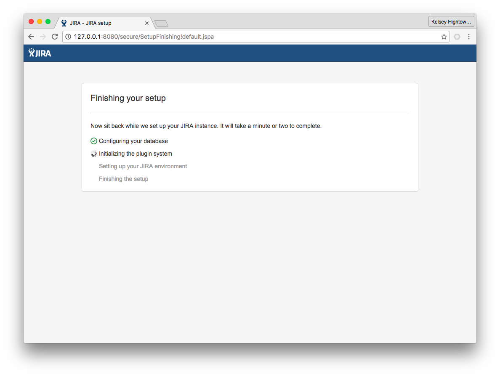

# Jira on Kubernetes

These are my rough notes on how to run a single node Jira server using the built-in H2 database. You MUST understand how Jira works, these are just my notes.

## Overview

- This guide is only showing the high level steps to provision a basic Jira setup
- This is NOT production ready. Do not run Jira like this in production. These are just notes on the basics.

## What makes this work

- 1 Deployment for the Jira server
- Persistent disk for `jira-home` directory

## Usage

### Create a Volume for Persistence 

```
gcloud compute disks create jira-home
```

### Jira Deployment

```
kubectl create -f jira-deployment.yaml
```

This may take a while! Currently this container is huge! Like `1.972 GB` huge. I'll fix that later.

```
kubectl get pods
```
```
NAME                    READY     STATUS              RESTARTS   AGE
jira-3035538708-picc5   0/1       ContainerCreating   0          1m
```

Once the download completes you'll be good to go:

```
$ kubectl get pods
```
```
NAME                    READY     STATUS    RESTARTS   AGE
jira-3035538708-picc5   1/1       Running   0          2m
```

### Configure Jira

Access you Jira install using a local port forward. You don't want to get hacked right out of the gate.

```
kubectl port-forward jira-3035538708-picc5 8080:8080
```
```
Forwarding from 127.0.0.1:8080 -> 8080
Forwarding from [::1]:8080 -> 8080
```

Visit http://127.0.0.1:8080 in your browser and complete the initial setup.





### Create an External Service

Once you have Jira all setup you can expose it on the public internet. This setup is not secure so you'll need to do some extra work get HTTPS working.

```
kubectl create -f jira-service.yaml
```

```
service "jira" created
```

```
kubectl get services
```
```
NAME         CLUSTER-IP       EXTERNAL-IP       PORT(S)    AGE
jira         10.215.240.111   XXX.XXX.XXX.XXX   8080/TCP   1m
kubernetes   10.215.240.1     <none>            443/TCP    14d
```

At this point you can visit Jira on http://XXX.XXX.XXX.XXX:8080.
